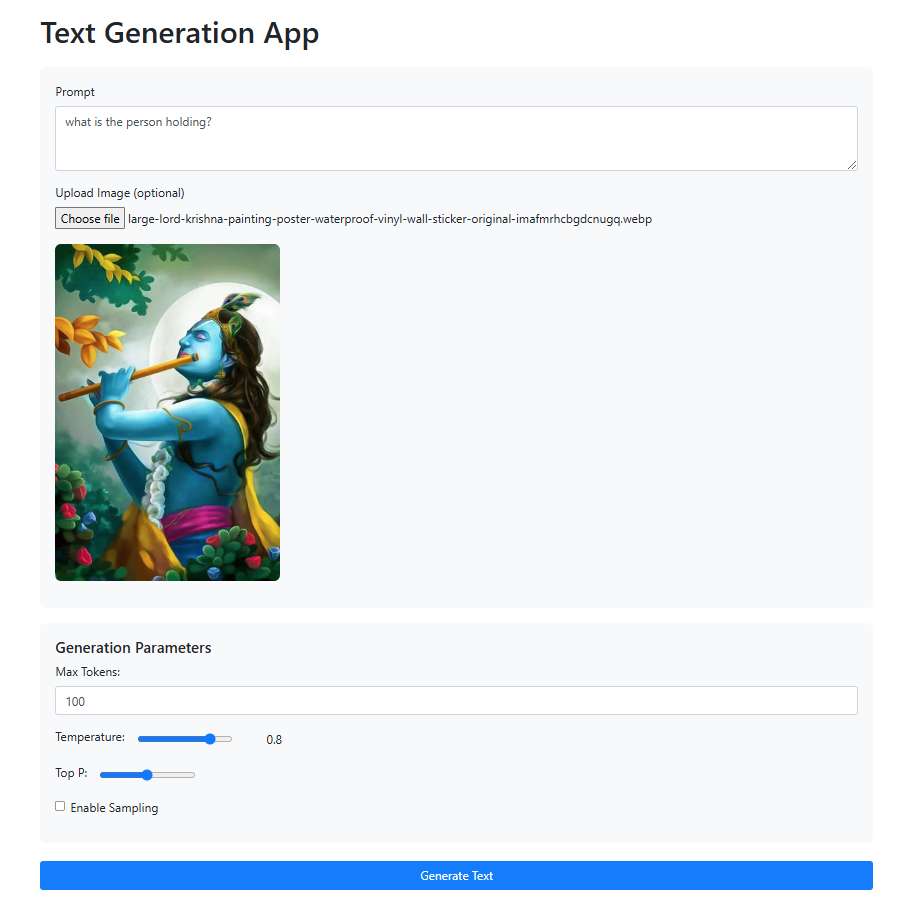
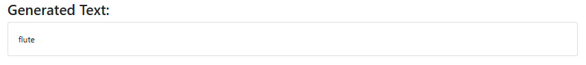
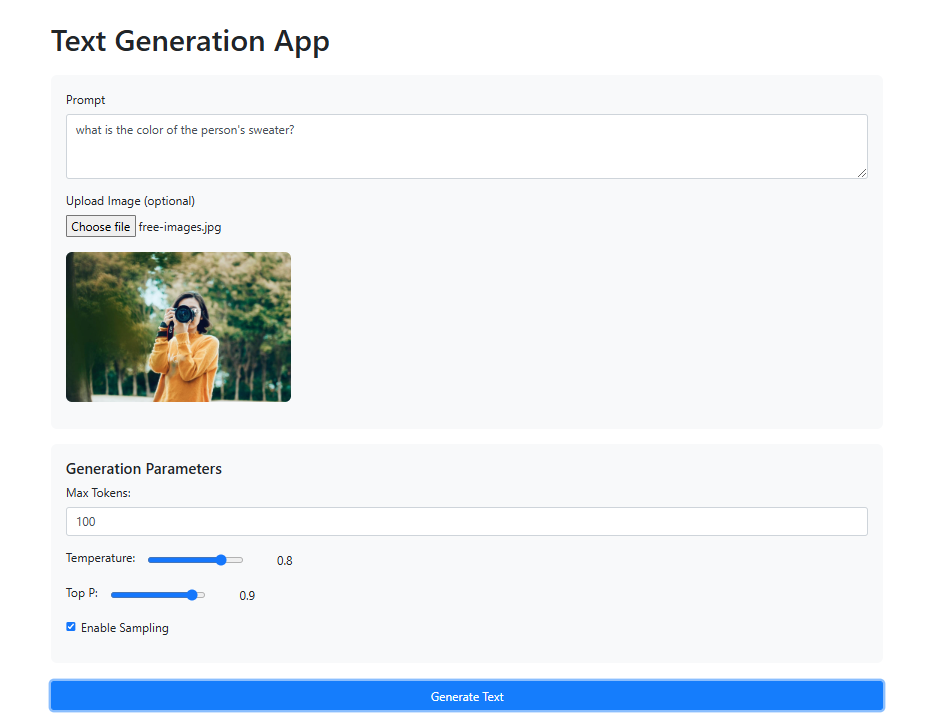

# 🌟 PaliGemma-from-scratch

This project is the recreation of Paligemma.

---




---
## 🚀 Setup Instructions

### 1️⃣ Create a Conda Environment
```bash
conda create -n paligemma python=3.10
conda activate paligemma
```

### 2️⃣ Clone the Repository & Install Dependencies
```bash
git clone https://github.com/Viditnegi/PaliGemma-from-scratch
cd PaliGemma-from-scratch
pip install -r requirements.txt
```

### 3️⃣ Install Additional Dependencies (if needed)
```bash
pip install -r requirements.txt
```

### 4️⃣ Download Model Weights
```bash
git clone https://huggingface.co/google/paligemma-3b-pt-224
```
💡 **Note:** You'll need to enter your Hugging Face access token when prompted.

### 5️⃣ Run the Application
```bash
python app.py
```

### 6️⃣ Upload an Image & Generate
- Upload an image 📷  
- Adjust parameters ⚙️  
- Generate results! ✨  

---

### 🎯 **You're all set! Enjoy using PaliGemma!** 🎯

---
